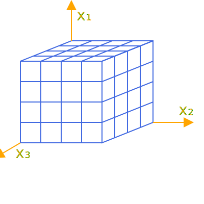
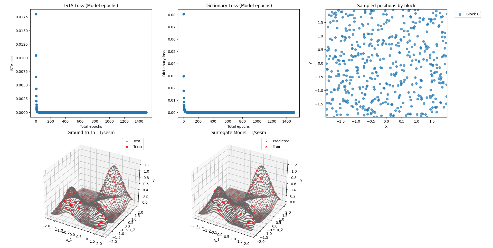

# PySESM User's Manual

## 1. Prepare environment

With `conda` or `micromamba`, create your working environment with

    > conda create -n "sesm" python=3.12
    
Install your PyTorch according to your hardware configuration.  For
instance, if you only have CPU:

    > pip3 install torch torchvision --index-url https://download.pytorch.org/whl/cpu
    
or if you have GPU with CUDA 12.8:

    > pip3 install torch torchvision

For PyTorch it is preferable to check https://pytorch.org for the
proper up-to-date install configuration.

## 2. Dependencies and SESM installation

This requires at least Python 3.12 and the dependencies listed in
requirements.txt.  Besides the Python core libraries, PySESM relies on
PyTorch and numpy, although additional libraries are used in the
examples for visualization and dataset creation.

This, will install PySESM and its dependencies:

    > pip install -e . 
    
or 

    > pip install -e . --use-pep517
	
The experiments, examples and so on need additional libraries that
you can install with

    > pip install -e ".[dev]"
	
    
However, if you prefer to install the dependency packages with
`micromamba` or `conda`, then you can use:

    > conda install numpy matplotlib scipy scikit-learn pandas plotly


## 3. Introduction

PySESM is a PyTorch-based Python library that implements SESM
(Sparse-Encoded Surrogate Model).  PySESM is designed for high-performance
surrogate modeling and function approximation. It excels at
representing complex, high-dimensional functions by implementing a
powerful 'divide and conquer' strategy. The core architecture
partitions the input space into manageable blocks, each handled by a
local model. A key innovation is its use of a globally shared,
learnable dictionary of basis functions (e.g., Gaussians) combined
with block-specific sparse codes. This approach allows the model to
learn a rich, shared representation of the function's features while
using sparse, localized codes to efficiently capture the specific
behavior in different regions of the input space, resulting in a
highly flexible and scalable framework for scientific computing and
machine learning tasks.
### Core Concepts

1.  **Space Partitioning:** The input data space is divided into smaller, manageable regions called "blocks." This allows the model to focus on learning local features of a function, making it highly scalable and effective for complex, non-stationary functions.

<p align="center">
  
</p>

<div align="center">
  <svg width="400" height="400" viewBox="0 0 200 200" xmlns="http://www.w3.org/2000/svg">
    <defs>
      <marker id="arrow" markerWidth="10" markerHeight="10" 
              refX="0" refY="3" orient="auto">
        <polygon points="0 0, 6 3, 0 6" fill="orange"/>
      </marker>
    </defs>
    <rect x="20" y="60" width="80" height="80" fill="none" stroke="royalblue"/>
    <line x1="20" y1="80" x2="100" y2="80" stroke="royalblue"/>
    <line x1="20" y1="100" x2="100" y2="100" stroke="royalblue"/>
    <line x1="20" y1="120" x2="100" y2="120" stroke="royalblue"/>
    <line x1="40" y1="60" x2="40" y2="140" stroke="royalblue"/>
    <line x1="60" y1="60" x2="60" y2="140" stroke="royalblue"/>
    <line x1="80" y1="60" x2="80" y2="140" stroke="royalblue"/>
    <polygon points="100,60 150,40 150,120 100,140" fill="none" stroke="royalblue"/>
    <line x1="125" y1="50" x2="125" y2="130" stroke="royalblue"/>
    <line x1="137.5" y1="45" x2="137.5" y2="125" stroke="royalblue"/>
    <line x1="112.5" y1="55" x2="112.5" y2="135" stroke="royalblue"/>
    <line x1="100" y1="80" x2="150" y2="60" stroke="royalblue"/>
    <line x1="100" y1="100" x2="150" y2="80" stroke="royalblue"/>
    <line x1="100" y1="120" x2="150" y2="100" stroke="royalblue"/>
    <polygon points="20,60 100,60 150,40 70,40" fill="none" stroke="royalblue"/>
    <line x1="40" y1="60" x2="90" y2="40" stroke="royalblue"/>
    <line x1="60" y1="60" x2="110" y2="40" stroke="royalblue"/>
    <line x1="80" y1="60" x2="130" y2="40" stroke="royalblue"/>
    <line x1="112.5" y1="55" x2="32.5" y2="55" stroke="royalblue"/>
    <line x1="125" y1="50" x2="45" y2="50" stroke="royalblue"/>
    <line x1="137.5" y1="45" x2="57.5" y2="45" stroke="royalblue"/>
    <line x1="150" y1="120" x2="180" y2="120"
          stroke="orange" marker-end="url(#arrow)"/>
    <line x1="70" y1="40" x2="70" y2="10"
          stroke="orange" marker-end="url(#arrow)"/>
    <line x1="20" y1="140" x2="3" y2="150"
          stroke="orange" marker-end="url(#arrow)"/>
    <text x="75" y="20" font-size="15" fill="orange">x₁</text>
    <text x="175" y="113" font-size="15" fill="orange">x₂</text>
    <text x="15" y="155" font-size="15" fill="orange">x₃</text>
  </svg>
</div>


2.  **Dictionary Learning:** The model learns a global dictionary of basis functions (e.g., Gaussian functions). These functions, or "dictionary words," serve as the fundamental building blocks for approximating the target function. The dictionary is shared across all blocks.
$$D(\underline{x}) = \left( \underline{\phi_1} (\underline{x}), \underline{\phi_2} (\underline{x}), \underline{\phi_2} (\underline{x}), ... ,  \underline{\phi_n} (\underline{x})  \right)$$


3.  **Sparse Coding:** For each block, the model finds a sparse vector `h` that represents the optimal linear combination of dictionary words to approximate the function within that block's local region. The goal is to use as few dictionary words as possible, hence "sparse."


The core idea is to approximate the ground truth signal $ \mathbf{y} $ as the product $ \mathbf{D}\mathbf{h} $ where $ \mathbf{D} $ is the learned **dictionary** and $ \mathbf{h} $ is the corresponding **sparse code**. In this formulation, $ \mathbf{y} \in \mathbb{R}^{(m,1)} $ represents an $ m $-dimensional target vector, $ \mathbf{D} \in \mathbb{R}^{(m,n)} $ is a matrix containing $ n $ basis functions (or atoms) as its columns, and $ \mathbf{h} \in \mathbb{R}^{(n,1)} $ is a sparse activation vector indicating how much each atom contributes to reconstructing $ \mathbf{y} $.

$$\underline{y} = D \underline{h}$$

$$
\underbrace{
\begin{bmatrix}
y_1 \\[3pt]
y_2 \\[3pt]
\vdots \\[3pt]
y_{\text{m}}
\end{bmatrix}
}_{\mathbf{y} \in \mathbb{R}^{(\text{m},\,1)}}
=
\underbrace{
\begin{bmatrix}
| & | & & | \\
\mathbf{\underline{\phi}}_1 & \mathbf{\underline{\phi}}_2 & \cdots & \mathbf{\underline{\phi}}_{\text{n}} \\
| & | & & |
\end{bmatrix}
}_{\mathbf{D} \in \mathbb{R}^{(\text{m},\,\text{n})}}
\;
\underbrace{
\begin{bmatrix}
h_1 \\[3pt]
h_2 \\[3pt]
\vdots \\[3pt]
h_{\text{n}}
\end{bmatrix}
}_{\mathbf{h} \in \mathbb{R}^{(\text{n},\,1)}}
$$

## 4. Library Architecture

The power of `pysesm` lies in its modular and configuration-driven design. You can easily swap out components for partitioning, sparse coding, and dictionary learning to tailor the model to your specific problem.

 <!-- Placeholder for a potential architecture diagram -->

### The Configuration-Driven Design

Every aspect of a `pysesm` model is controlled by a hierarchy of configuration objects (Python dataclasses). This makes experiments reproducible, readable, and easy to modify.

The main configuration object, `SSESMConfig` or `BSESMConfig`, contains sub-configurations for each major component:

```python
# A typical configuration structure
ssesm_config = SSESMConfig(
    n_features=2,
    model_epochs=500,
    # 1. Configuration for the space partitioner
    partition_config=UniformPartitionConfig(...),
    # 2. Configuration for the dictionary
    dict_config=GaussianDictConfig(...),
    # 3. Configuration for the sparse coding algorithm
    sparse_coding_config=ISTAConfig(...),
    ...
)
```

### Key Components

*   **Models (`pysesm.models`):** These are the main entry points for the user.
    *   `SESM`: The abstract base class for all models.
    *   `SSESM` (Sequential SESM): A training strategy where blocks are processed sequentially. The global dictionary is updated after each block is trained. This is robust and flexible.
    *   `BSESM` (Batched SESM): A training strategy where all active blocks are trained on in a single batch step. This can be more computationally efficient.

*   **Partition Managers (`pysesm.blocks`):** This component is responsible for dividing the input space.
    *   `UniformPartitionManager`: Divides the space into a uniform grid. You specify the number of blocks per dimension (`T`).
    *   `AdaptativePartitionManager`: Uses a KD-Tree to dynamically partition the space based on data density, creating blocks of varying sizes where needed.

*   **Dictionary Layers (`pysesm.dictionaries`):** This component manages the dictionary of basis functions (`D`).
    *   `DictBaseLayer`: The abstract base class.
    *   `GaussianDictLayer`: The primary implementation, which uses a dictionary of Gaussian functions. It learns the means (`mu`) and covariance-related parameters (`rho`) of each Gaussian.

*   **Sparse Coding Layers (`pysesm.sparse_coding`):** This component is responsible for finding the sparse activation vector (`h`) for each block.
    *   `SparseCodingBaseLayer`: The abstract base class.
    *   `ISTALayer`: Implements the Iterative Shrinkage-Thresholding Algorithm. A classic, fundamental choice.
    *   `FISTALayer`: Implements the Fast Iterative Shrinkage-Thresholding Algorithm, which often converges faster than ISTA by using a momentum term.
    *   `ADMMLayer`: Implements the Alternating Direction Method of Multipliers, a powerful and often more robust solver.

*   **Factories (`pysesm.factories`):** The library uses a factory pattern to instantiate components based on the provided configuration objects. This is handled internally but is a key part of the flexible design.

## 4. Getting Started: A Basic Example

Let's walk through a complete example of approximating a 2D function composed of three Gaussian distributions using a single block. This is based on `one_block_example.py`.

### Step 1: Setup Logger

It's always good practice to set up a logger to see the model's progress.

```python
import logging
from pysesm.utils.loggers import setup_logger

logger = setup_logger(level=logging.INFO)```

### Step 2: Define Model Configurations

This is the most important step. We define the configuration for each component of our model.

```python
import torch
from pysesm.models.SSESM import SSESMConfig
from pysesm.blocks import UniformPartitionConfig
from pysesm.dictionaries import GaussianDictConfig, GaussianDictLayer
from pysesm.sparse_coding import ISTAConfig, StepSizeMethod

# --- Overall Model Parameters ---
n_features = 2  # Our data is 2-dimensional (x, y)
n_functions = 100 # We want our dictionary to have 100 Gaussian functions

# 1. Partition Configuration: A single block covering the space [-2, 2] on each axis.
partition_config = UniformPartitionConfig(
    T=1, # T=1 creates a single block
    initial_bounds=torch.tensor([[-2, -2], [2, 2]], dtype=torch.float32),
)

# 2. Dictionary Configuration: A dictionary of Gaussian functions.
dict_config = GaussianDictConfig(
    epochs=100,
    alpha=0.01, # Learning rate for dictionary updates
    criterion=torch.nn.MSELoss(),
    optimizer_factory=lambda params, lr: torch.optim.AdamW(params, lr=lr),
    # Use electrostatic regularization to encourage dictionary words to spread out
    regularization_func=GaussianDictLayer.electrostatic_regularization,
    regularization_gamma=0.001,
)

# 3. Sparse Coding Configuration: Use the ISTA algorithm.
sparse_coding_config = ISTAConfig(
    epochs=150,
    alpha=0.15, # Step size for ISTA
    lambd=0.005, # Sparsity penalty (higher means more sparse `h` vectors)
    step_size_method=StepSizeMethod.FROBENIUS,
    n_functions=n_functions,
    criterion=torch.nn.MSELoss(),
)

# 4. Main SSESM Configuration: Combine all the pieces.
ssesm_config = SSESMConfig(
    n_features=n_features,
    model_epochs=1500, # Total training epochs for the model
    partition_config=partition_config,
    dict_config=dict_config,
    sparse_coding_config=sparse_coding_config,
    log_interval=50, # Log progress every 50 epochs
)
```

### Step 3: Generate Dataset

PySESM provides utility functions to generate sample datasets in `PySESM\pysesm\utils_dataset\generate_dataset.py`. For example, we create a function composed of three non-diagonal Gaussians.


```python
from pysesm.utils_dataset.generate_dataset import generate_gaussian_dataset
from pysesm.utils_dataset.gaussian_covariance_density import generate_nondiag_covariance_matrices

# Generate some interesting, non-diagonal covariance matrices
sigma1, sigma2, sigma3 = generate_nondiag_covariance_matrices()

# Create training and test datasets
(trainDataset, X_train, y_train,
 testDataset, X_test, y_test,
 gt_mu, gt_sigma) = generate_gaussian_dataset(
    n_samples=500,
    variances=[sigma1, sigma2, sigma3]
)
```

### Step 4: Instantiate and Train the Model

With the configuration and data ready, we can instantiate the `SSESM` model and start the training by calling `partial_fit`.

```python
from pysesm.models.SSESM import SSESM

# Define the experiment parameters
experiment = {
    "config": ssesm_config,
    "seed": 45
}

# Instantiate the model
model = SSESM(**experiment, logger=logger)

# Train the model
logging.info("Training model...")
model.partial_fit(X_train, y_train)
```

### Step 5: Evaluate the Model

After training, you can evaluate the model's performance on the test set.

```python
y_predicted, time, mse_value = model.performance_stats(X_test, y_test)

logging.info(
    f"Model: {model.__class__.__name__}, MSE Value = {mse_value:.6f}, time = {time:.2f} min"
)
```

## 4. Examples
### One block example `examples/one_block_example.py`


The one-block configuration treats the whole input space as a single partition. This is the simplest setup and a good baseline before introducing multiple blocks.

<p align="center">
  
</p>

In this example, you can see real-time training using the `VisualizerHook` class. This hook captures snapshots of the dictionary at each logging interval and compiles them into a video.

<p align="center">
<video src="figs/one_block_evolution.mp4" controls width="600">
</p>


### Multi-Block Partitioning example `examples/multi_block_example.py`

Multi-block partitioning divides the input domain into several smaller regions (blocks) so the model can learn local behaviour in each block independently while sharing a global dictionary. This approach improves scalability and accuracy on complex, non-stationary functions because each block fits simpler local patterns. Use `UniformPartitionConfig` to create regular grids (or `AdaptativePartitionConfig` for data-driven splits), and tune `T` (blocks per dimension) and `overlap_ratio` to balance locality versus continuity between blocks.

To handle more complex functions, you can easily partition the space into a grid. The only change required is in the `UniformPartitionConfig`.

```python
# From multi_block_example.py

# Create initial bounds for the N-dimensional space
domain_limits = (-2.0, 2.0)
initial_bounds_list = [[domain_limits[0]] * n_features, [domain_limits[1]] * n_features]
initial_bounds_tensor = torch.tensor(initial_bounds_list, dtype=torch.float32)

# Create T for an N-dimensional grid (e.g., 2 blocks per dimension)
blocks_per_dim = 2
t_list = [blocks_per_dim] * n_features
t_tensor = torch.tensor(t_list)

partition_config = UniformPartitionConfig(
    T=t_tensor,
    initial_bounds=initial_bounds_tensor,
    device=torch.device("cuda" if torch.cuda.is_available() else "cpu")
)

```
The rest of the training pipeline remains the same.


## 5. API Reference (Core Classes)

*   `pysesm.models.SSESM(config, logger, **kwargs)`
    *   `.partial_fit(X, y)`: Trains the model on the provided data. This is the main training method.
    *   `.predict(X)`: Generates predictions for new input data `X`.
    *   `.performance_stats(X, y)`: Evaluates the model, returning predictions, training time, and MSE.

*   `pysesm.models.SSESMConfig`: Main configuration dataclass.
*   `pysesm.blocks.UniformPartitionConfig`: Configuration for grid-based partitioning.
*   `pysesm.blocks.AdaptativePartitionConfig`: Configuration for data-driven partitioning.
*   `pysesm.dictionaries.GaussianDictConfig`: Configuration for the Gaussian dictionary.
*   `pysesm.sparse_coding.ISTAConfig`: Configuration for the ISTA solver.
*   `pysesm.sparse_coding.FISTAConfig`: Configuration for the FISTA solver.
*   `pysesm.sparse_coding.ADMMConfig`: Configuration for the ADMM solver.
