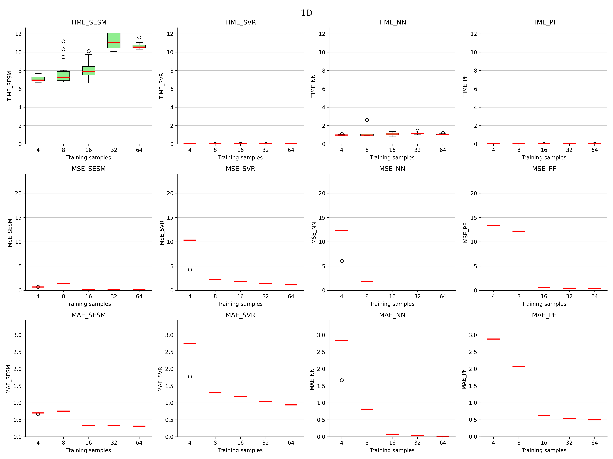
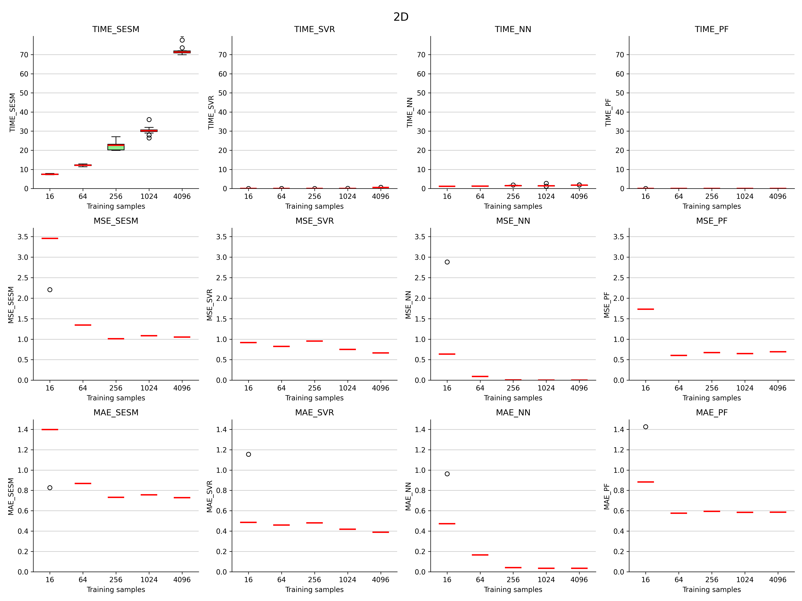
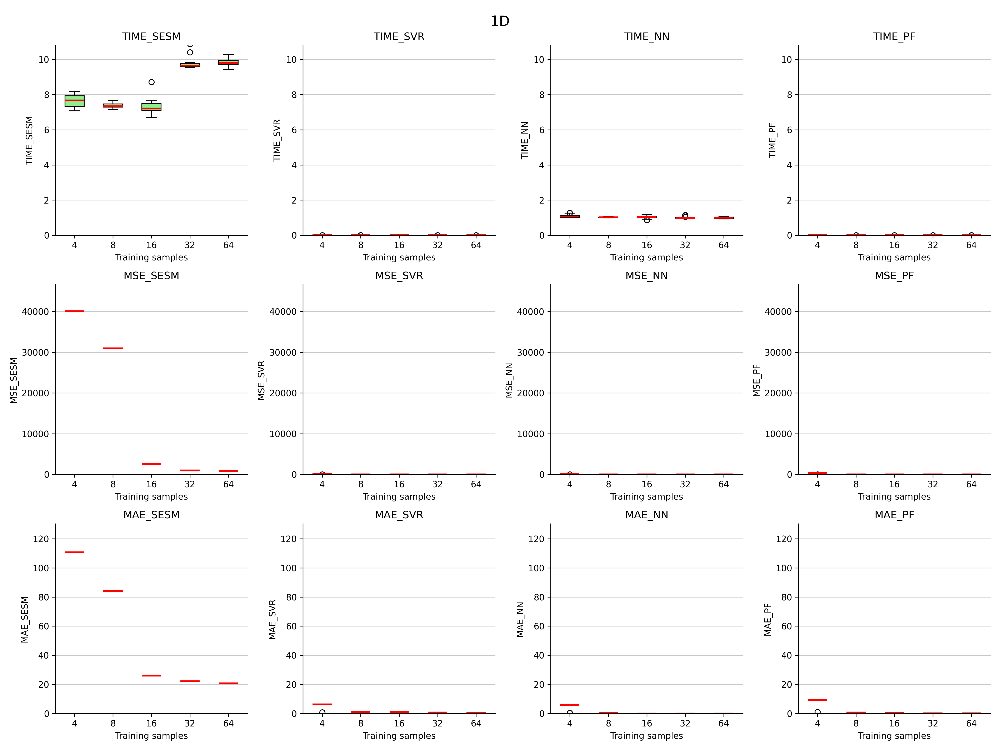
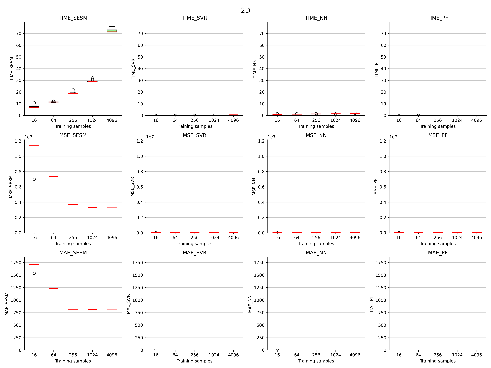
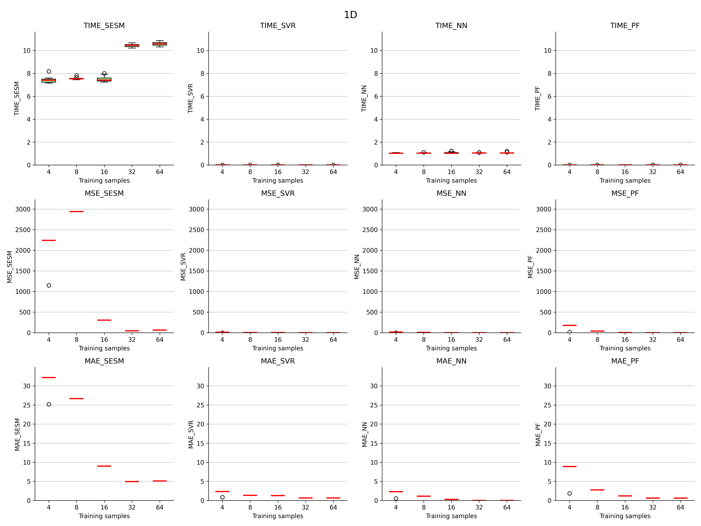
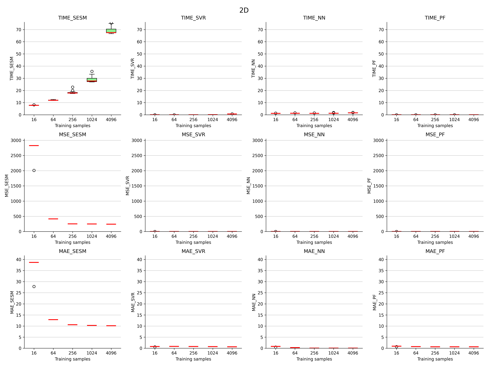

#  Reporte de Experimento PySESM

## Configuración de los modelos
| Modelo | Configuración |
| :--- | :--- |
| **SVR (Support Vector Regressor)** | svr_config |
| **PF (Polynomial Features)** | pf_config |
| **NN (Neural Network)** | nn_config |
| **SESM (Sparse Encoding Surrogate Model)** | sesm_config |

## Configuración del experimento
| Categoría | Elementos |
| :--- | :--- |
| **Métricas** | mae, mse, time |
| **Dimensiones** | [1, 2] |
| **Repeticiones** | 10 |
| **Funciones** | zakharov, styblinski tang, zhou |
| **Tamaño del dataset 1D** | [4, 8, 16, 32, 64] |

---

## function_zhou

  
  

---

## function_zakharov

  
  
---

## function_styblinski_tang
  
  

